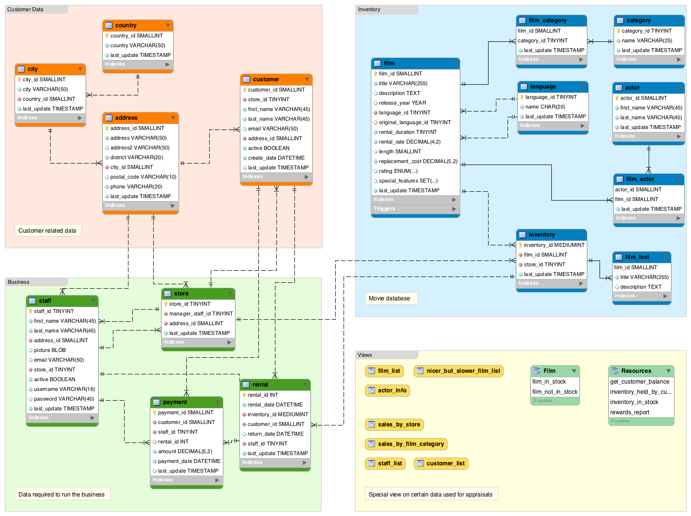

# Avaliação Banco de Dados: SQL

Desenvolvimento de Aplicações Web -- 2023

Professor: João Eduardo Montandon

Valor: 15 pontos

Duração: 180 minutos

## Setup da Prova

1. Clone o repositório para a sua máquina
1. Crie uma imagem Docker para o banco de dados MySQL a partir do Dockerfile presente no repositório.
Utilize o seguinte comando:
    ```bash
    docker build -t daw-prova-mysql .
    ```
1. Execute o container a partir da imagem criada no passo anterior. Utilize o seguinte comando:
    ```bash
    docker run -d -p 3333:3306 --name 2023-daw-prova-mysql daw-prova-mysql
    docker start 2023-daw-prova-mysql
    docker exec -it 2023-daw-prova-mysql bash
    ```
1. Acesse o console do banco de dados utilizando o seguinte comando:
    ```bash
    mysql -u root -p
    ```
    A senha é **root**.
1. Execute o comando `SHOW DATABASES;` e verifique se há um banco de dados chamado `sakila`.
1. Este é o banco que você usará na prova. Execute o comando `USE sakila;` para selecioná-lo.


## Locadora de Filmes

O banco de dados abaixo foi modelado para atendar a uma locadora de filmes. 
Ele é composto por 16 tabelas, que armazenam informações sobre clientes, filmes, atores, pagamentos, etc.
Seu diagrama relacional é apresentado abaixo:



Analise o diagrama e crie consultas SQL para responder as questões abaixo.

## Questões 

Para cada questão crie um arquivo chamado `questao-XX.sql`, onde XX é o número da questão.
**Arquivos fornecidos em outros formatos serão desconsiderados!**

1. Selecionar todos os registros da tabela de clientes
1. Selecionar países distintos da tabela de países
1. Selecionar informações de aluguel, incluindo nomes dos clientes e datas de aluguel
1. Contar o número de filmes no inventário
1. Encontrar os 5 principais clientes que mais alugaram filmes
1. Calcular a receita total de todos os aluguéis
1. Listar os atores que apareceram em mais de 10 filmes
1. Descobrir os filmes alugados pelo cliente de id 2873
1. Listar todas as categorias e o número de filmes em cada categoria
1. Encontrar os filmes que não estão em estoque
1. Obter o número total de clientes por loja
1. Encontrar clientes que não alugaram nenhum filme
1. Encontrar os clientes que alugaram mais de um filme no mesmo dia
1. Obter a receita total por loja
1. Descobrir os 3 filmes mais lucrativos
