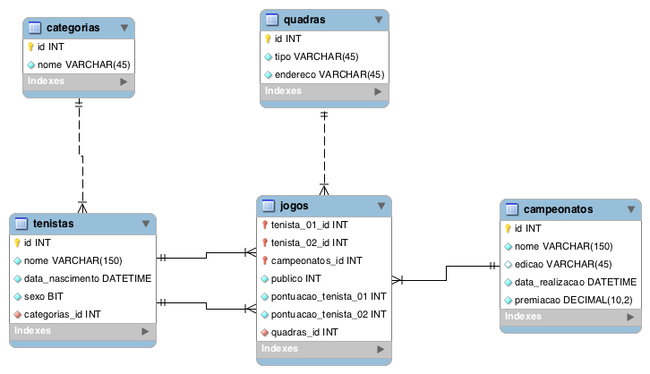

# Avaliação Banco de Dados: SQL

Desenvolvimento de Aplicações Web -- 2018

Professor: João Eduardo Montandon

Valor: 10 pontos

Duração: 240 minutos

## Instruções

* Prova individual, com consulta (aos arquivos listados abaixo) e em silêncio sepulcral.
  * Material desenvolvido durante as aulas.
  * Exercícios realizados em sala de aula.
  * [Documentação MySQL (Seções 13.1 e 13.2).](http://dev.mysql.com/doc/refman/5.7/en/sql-syntax.html)
  * Fóruns e Q&As: StackOverflow, entre outros.
* É proibida a utilização de material de consulta de terceiros, bem como o empréstimo de material.
* Questões com soluções copiadas da Internet ou subsidiadas por terceiros serão anuladas.
* [Script para criação da estrutura](scripts/script_ddl.sql)
* [Script para inserção dos dados](scripts/script_dml.sql)

## Federação Estadual de Tênis

Dado o DER descrito acima, elabore as seguintes consultas:

1. Listar os campeonatos que foram concluídos a mais de dois anos atrás, junto da premiação de cada um.
1. Listar os tenistas junto de sua categoria.
1. Listar o público total de cada quadra.
1. Listar, para cada jogo, o nome e a pontuação de cada tenista, além do nome do campeonato e o tipo da quadra.
1. Listar quantos jogos cada tenista jogou por campeonato.
1. Listar o nome, a média de público e a premiação de cada campeonato.
1. Listar quantos jogos cada jogador jogou por ano, ordenada pelo ano de forma descrescente.
1. Listar a média de público em cada quadra nos jogos que ocorreram no ano de  2014, ordenada pelas que tiveram maior média.
1. Listar as tenistas mulheres que ganharam pelo menos 3 jogos.
1. Listar o tenista mais assediado pela torcida (aquele que possui a melhor média de público em seus jogos).

**Extras:**

1. Listar o nome e a quantidade de vitórias do tenista mais vitorioso na história de todos os campeonatos (1,0).